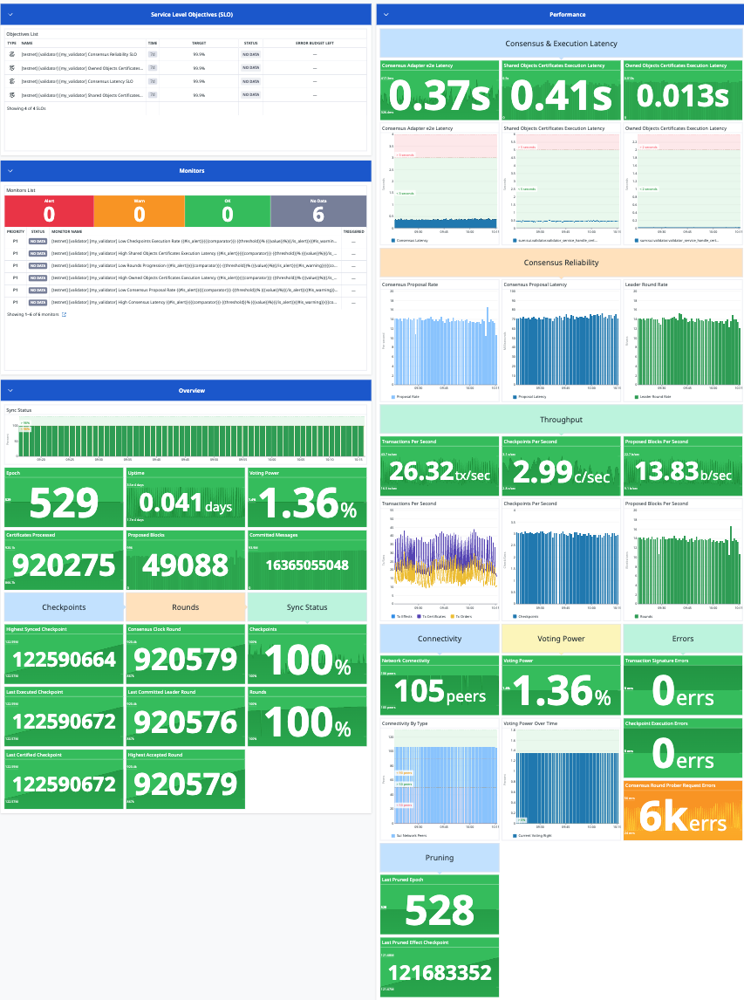

# SUI Terraform Modules

Welcome to the Terraform Modules for SUI Network, your all-in-one solution for deploying, monitoring, and managing SUI infrastructure with ease.

## Key Features
- **Infrastructure Deployment:** Easily deploy and manage your SUI network infrastructure using modular and scalable Terraform modules.
- **Comprehensive Monitoring:** Gain full visibility into your network's performance with built-in Datadog monitors, alerts, and Service Level Objectives (SLOs) created based on requirements provided by SUI Foundation and Mysten Labs.
- **Validator and Full Node Observability:** Monitor the performance of your validators and full nodes with detailed metrics and dashboards.
- **Network Overview:** Get a comprehensive overview of your SUI network's health and status with ease.

With these modules, you can create SLO monitors that adhere to the standards and requirements set by SUI Foundation and Mysten Labs. Ensure the reliability and efficiency of your SUI network while maintaining full control and customization over your monitoring and alerting processes.

Get started today and take your SUI infrastructure management to the next level with Terraform Modules for SUI Network.

## Modules

This repository is organized into modules, each residing in its respective subdirectory. Each subdirectory contains a README file providing comprehensive details about the Terraform modules. These README files cover essential information, including module dependencies, input variables, output details, and precise deployment instructions to ensure successful utilization of the modules.

To explore and gain a deeper understanding of any specific module, please navigate to the corresponding subdirectory and refer to the dedicated README file. Below is a list of subdirectories within this repository:

- [Datadog](./datadog/): The Datadog directory hosts Terraform modules designed for deploying and managing Datadog resources. These resources encompass dashboards, monitors, alerts, Service Level Objectives (SLOs), and various other components tailored for the SUI network and its entities. For comprehensive insights into each module's requirements, input parameters, output details, and step-by-step deployment instructions, please consult the README file in the Datadog directory.

Please select the module that aligns with your needs and consult its dedicated README for an extensive overview of its usage and deployment guidelines.

## License

Copyright 2024 BartestneT

Licensed under the Apache License, Version 2.0 (the "License");
you may not use this file except in compliance with the License.
You may obtain a copy of the License at

     http://www.apache.org/licenses/LICENSE-2.0

Unless required by applicable law or agreed to in writing, software
distributed under the License is distributed on an "AS IS" BASIS,
WITHOUT WARRANTIES OR CONDITIONS OF ANY KIND, either express or implied.
See the License for the specific language governing permissions and
limitations under the License.